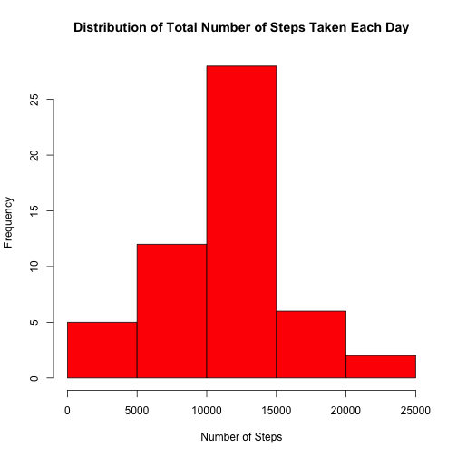
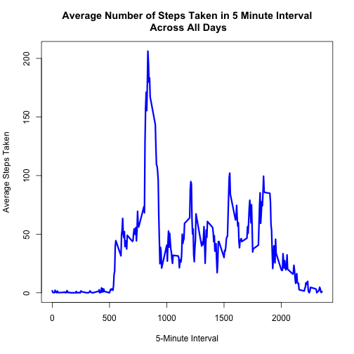
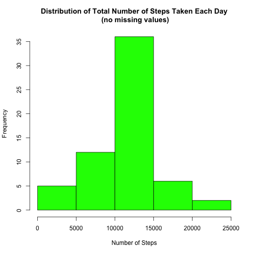
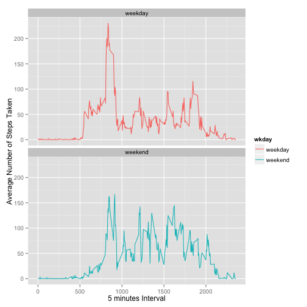

####Loading and preprocessing the data:
Load libraries that will be required to conduct analysis:

```r
library("ggplot2")
```

```
## Use suppressPackageStartupMessages to eliminate package startup messages.
```

```r
library("xtable")
```
Loading Input file:

```r
myfile<-read.csv("activity.csv",header=TRUE,na.strings="NA")
```
Input file should appear in the following way:

```r
tbl<-xtable(head(myfile))
print(tbl,type="html")
```

<!-- html table generated in R 3.1.2 by xtable 1.7-4 package -->
<!-- Sat Mar 14 21:09:15 2015 -->
<table border=1>
<tr> <th>  </th> <th> steps </th> <th> date </th> <th> interval </th>  </tr>
  <tr> <td align="right"> 1 </td> <td align="right">  </td> <td> 2012-10-01 </td> <td align="right">   0 </td> </tr>
  <tr> <td align="right"> 2 </td> <td align="right">  </td> <td> 2012-10-01 </td> <td align="right">   5 </td> </tr>
  <tr> <td align="right"> 3 </td> <td align="right">  </td> <td> 2012-10-01 </td> <td align="right">  10 </td> </tr>
  <tr> <td align="right"> 4 </td> <td align="right">  </td> <td> 2012-10-01 </td> <td align="right">  15 </td> </tr>
  <tr> <td align="right"> 5 </td> <td align="right">  </td> <td> 2012-10-01 </td> <td align="right">  20 </td> </tr>
  <tr> <td align="right"> 6 </td> <td align="right">  </td> <td> 2012-10-01 </td> <td align="right">  25 </td> </tr>
   </table>
####Run Analysis: What is mean total number of steps taken per day?
  Step1. Calculate the total number of steps taken per day

```r
myfile1<-na.omit(myfile[c(1,2)])
steptotal<-aggregate(myfile1$steps, by=list(myfile1$date),sum)
```
  Step2. Make a histogram of the total number of steps taken each day

```r
steps<-as.numeric(steptotal[[2]])
hist(steps,main = "Distribution of Total Number of Steps Taken Each Day",xlab="Number of Steps",col="red")
```

 
  
  
  Step3.Calculate and report the mean and median of the total number of steps taken per day

```r
colnames(steptotal)<-c("Date","Total.Steps")
stepsmu<-mean(as.numeric(steptotal$Total.Steps))
stepsmedian<-median(as.numeric(steptotal$Total.Steps))
print(paste("Mean total number of steps taken per day",round(stepsmu),sep=" : "))
```

```
## [1] "Mean total number of steps taken per day : 10766"
```

```r
print(paste("Median total number of steps taken per day",round(stepsmedian),sep=" : "))
```

```
## [1] "Median total number of steps taken per day : 10765"
```

####Run Analysis: What is the average daily activity pattern?
  Step1.Make a time series plot (i.e. type = "l") of the 5-minute interval (x-axis)           and the average number of steps taken, averaged across all days (y-axis)

```r
myfile2<-na.omit(myfile)
int5stepmu<-aggregate(myfile2$steps, by=list(myfile2$interval),mean)
```

```r
plot(int5stepmu,type="l",lwd=3,col="blue",xlab="5-Minute Interval",ylab ="Average Steps Taken", main = "Average Number of Steps Taken in 5 Minute Interval\n Across All Days")
```

 
  
  
  Step2.Which 5-minute interval, on average across all the days in the dataset, contains the maximum number of steps?

```r
maxint<-subset(int5stepmu,int5stepmu[2]==max(int5stepmu[2]))[[1]]
print(paste("Following 5-minute interval, on average across all the days in the dataset, contains the maximum number of steps",maxint,sep=" : "))
```

```
## [1] "Following 5-minute interval, on average across all the days in the dataset, contains the maximum number of steps : 835"
```
####Imputing missing values
  Step1.Calculate and report the total number of missing values in the dataset (i.e. the total number of rows with NAs)

```r
misval <- sum(is.na(myfile))
print(paste("Total number of missing values in the dataset",misval,sep=" : "))
```

```
## [1] "Total number of missing values in the dataset : 2304"
```
  Step2.Filling the missing values in the dataset, using mean for the day.
  Step3.Create a new dataset that is equal to the original dataset but with the missing data filled in 

```r
newfile<-myfile
for (i in 1:nrow(newfile)){  
  if(is.na(newfile[i,1])){newfile[i,1]<-
    mean(na.omit(subset(myfile,myfile[3]==as.character(newfile[i,3]))[[1]]))
  } 
}
```
New dataset appears in the following way:

```r
tbl1<-xtable(head(newfile))
print(tbl1,type="html")
```

<!-- html table generated in R 3.1.2 by xtable 1.7-4 package -->
<!-- Sat Mar 14 21:09:31 2015 -->
<table border=1>
<tr> <th>  </th> <th> steps </th> <th> date </th> <th> interval </th>  </tr>
  <tr> <td align="right"> 1 </td> <td align="right"> 1.72 </td> <td> 2012-10-01 </td> <td align="right">   0 </td> </tr>
  <tr> <td align="right"> 2 </td> <td align="right"> 0.34 </td> <td> 2012-10-01 </td> <td align="right">   5 </td> </tr>
  <tr> <td align="right"> 3 </td> <td align="right"> 0.13 </td> <td> 2012-10-01 </td> <td align="right">  10 </td> </tr>
  <tr> <td align="right"> 4 </td> <td align="right"> 0.15 </td> <td> 2012-10-01 </td> <td align="right">  15 </td> </tr>
  <tr> <td align="right"> 5 </td> <td align="right"> 0.08 </td> <td> 2012-10-01 </td> <td align="right">  20 </td> </tr>
  <tr> <td align="right"> 6 </td> <td align="right"> 2.09 </td> <td> 2012-10-01 </td> <td align="right">  25 </td> </tr>
   </table>

  Step4.Make a histogram of the total number of steps taken each day and Calculate and report the mean and median total number of steps taken per day. Do these values differ from the estimates from the first part of the assignment? What is the impact of imputing missing data on the estimates of the total daily number of steps?

```r
newfile1<-newfile[c(1,2)]
steptotal1<-aggregate(newfile1$steps, by=list(newfile1$date),sum)

steps1<-as.numeric(steptotal1[[2]])
hist(steps1,main = "Distribution of Total Number of Steps Taken Each Day\n (no missing values)",xlab="Number of Steps",col="green")
```

 

```r
colnames(steptotal1)<-c("Date","Total.Steps")
stepsmu1<-mean(as.numeric(steptotal1$Total.Steps))
stepsmedian1<-median(as.numeric(steptotal1$Total.Steps))
print(paste("Mean total number of steps taken per day",round(stepsmu1),sep=" : "))
```

```
## [1] "Mean total number of steps taken per day : 10766"
```

```r
print(paste("Median total number of steps taken per day",round(stepsmedian1),sep=" : "))
```

```
## [1] "Median total number of steps taken per day : 10766"
```
####Run Analysis: Are there differences in activity patterns between weekdays and weekends?

  Step1.Create a new factor variable in the dataset with two levels - "weekday" and "weekend" indicating whether a given date is a weekday or weekend day.

```r
wkday<-c(1:nrow(newfile))
newfile2<-newfile
newfile2$date<-as.Date(newfile2$date)
for(r in 1:nrow(newfile2)){
  if(weekdays(newfile2[r,2])=="Saturday" | weekdays(newfile2[r,2])=="Sunday"){
    wkday[r]<-"weekend"
  }else{wkday[r]<-"weekday"}
}
newfile3<-cbind(newfile2,wkday)
```
New table should appear in the following way:

```r
tbl2<-xtable(head(newfile3))
print(tbl2,type="html")
```

```
## Warning in formatC(x = structure(c(15614, 15614, 15614, 15614, 15614,
## 15614: class of 'x' was discarded
```

<!-- html table generated in R 3.1.2 by xtable 1.7-4 package -->
<!-- Sat Mar 14 21:09:40 2015 -->
<table border=1>
<tr> <th>  </th> <th> steps </th> <th> date </th> <th> interval </th> <th> wkday </th>  </tr>
  <tr> <td align="right"> 1 </td> <td align="right"> 1.72 </td> <td align="right"> 15614.00 </td> <td align="right">   0 </td> <td> weekday </td> </tr>
  <tr> <td align="right"> 2 </td> <td align="right"> 0.34 </td> <td align="right"> 15614.00 </td> <td align="right">   5 </td> <td> weekday </td> </tr>
  <tr> <td align="right"> 3 </td> <td align="right"> 0.13 </td> <td align="right"> 15614.00 </td> <td align="right">  10 </td> <td> weekday </td> </tr>
  <tr> <td align="right"> 4 </td> <td align="right"> 0.15 </td> <td align="right"> 15614.00 </td> <td align="right">  15 </td> <td> weekday </td> </tr>
  <tr> <td align="right"> 5 </td> <td align="right"> 0.08 </td> <td align="right"> 15614.00 </td> <td align="right">  20 </td> <td> weekday </td> </tr>
  <tr> <td align="right"> 6 </td> <td align="right"> 2.09 </td> <td align="right"> 15614.00 </td> <td align="right">  25 </td> <td> weekday </td> </tr>
   </table>
  Step2.Make a panel plot containing a time series plot of the 5-minute interval (x-axis) and the average number of steps taken, averaged across all weekday days or weekend days (y-axis). 

```r
newfile4<- aggregate(steps ~ interval+wkday, newfile3, mean)
qplot(interval, steps,data=newfile4, geom="line",color=wkday, xlab = "5 minutes Interval", ylab = "Average Number of Steps Taken") + facet_wrap(~ wkday, ncol=1)
```

 


Thank you!


####Loading and preprocessing the data:
Load libraries that will be required to conduct analysis:

```r
library("ggplot2")
library("xtable")
```
Loading Input file:

```r
myfile<-read.csv("activity.csv",header=TRUE,na.strings="NA")
```
Input file should appear in the following way:

```r
tbl<-xtable(head(myfile))
print(tbl,type="html")
```

<!-- html table generated in R 3.1.2 by xtable 1.7-4 package -->
<!-- Sat Mar 14 21:09:41 2015 -->
<table border=1>
<tr> <th>  </th> <th> steps </th> <th> date </th> <th> interval </th>  </tr>
  <tr> <td align="right"> 1 </td> <td align="right">  </td> <td> 2012-10-01 </td> <td align="right">   0 </td> </tr>
  <tr> <td align="right"> 2 </td> <td align="right">  </td> <td> 2012-10-01 </td> <td align="right">   5 </td> </tr>
  <tr> <td align="right"> 3 </td> <td align="right">  </td> <td> 2012-10-01 </td> <td align="right">  10 </td> </tr>
  <tr> <td align="right"> 4 </td> <td align="right">  </td> <td> 2012-10-01 </td> <td align="right">  15 </td> </tr>
  <tr> <td align="right"> 5 </td> <td align="right">  </td> <td> 2012-10-01 </td> <td align="right">  20 </td> </tr>
  <tr> <td align="right"> 6 </td> <td align="right">  </td> <td> 2012-10-01 </td> <td align="right">  25 </td> </tr>
   </table>
####Run Analysis: What is mean total number of steps taken per day?
  Step1. Calculate the total number of steps taken per day

```r
myfile1<-na.omit(myfile[c(1,2)])
steptotal<-aggregate(myfile1$steps, by=list(myfile1$date),sum)
```
  Step2. Make a histogram of the total number of steps taken each day

```r
steps<-as.numeric(steptotal[[2]])
hist(steps,main = "Distribution of Total Number of Steps Taken Each Day",xlab="Number of Steps",col="red")
```

 
  
  
  Step3.Calculate and report the mean and median of the total number of steps taken per day

```r
colnames(steptotal)<-c("Date","Total.Steps")
stepsmu<-mean(as.numeric(steptotal$Total.Steps))
stepsmedian<-median(as.numeric(steptotal$Total.Steps))
print(paste("Mean total number of steps taken per day",round(stepsmu),sep=" : "))
```

```
## [1] "Mean total number of steps taken per day : 10766"
```

```r
print(paste("Median total number of steps taken per day",round(stepsmedian),sep=" : "))
```

```
## [1] "Median total number of steps taken per day : 10765"
```

####Run Analysis: What is the average daily activity pattern?
  Step1.Make a time series plot (i.e. type = "l") of the 5-minute interval (x-axis)           and the average number of steps taken, averaged across all days (y-axis)

```r
myfile2<-na.omit(myfile)
int5stepmu<-aggregate(myfile2$steps, by=list(myfile2$interval),mean)
```

```r
plot(int5stepmu,type="l",lwd=3,col="blue",xlab="5-Minute Interval",ylab ="Average Steps Taken", main = "Average Number of Steps Taken in 5 Minute Interval\n Across All Days")
```

 
  
  
  Step2.Which 5-minute interval, on average across all the days in the dataset, contains the maximum number of steps?

```r
maxint<-subset(int5stepmu,int5stepmu[2]==max(int5stepmu[2]))[[1]]
print(paste("Following 5-minute interval, on average across all the days in the dataset, contains the maximum number of steps",maxint,sep=" : "))
```

```
## [1] "Following 5-minute interval, on average across all the days in the dataset, contains the maximum number of steps : 835"
```
####Imputing missing values
  Step1.Calculate and report the total number of missing values in the dataset (i.e. the total number of rows with NAs)

```r
misval <- sum(is.na(myfile))
print(paste("Total number of missing values in the dataset",misval,sep=" : "))
```

```
## [1] "Total number of missing values in the dataset : 2304"
```
  Step2.Filling the missing values in the dataset, using mean for the day.
  Step3.Create a new dataset that is equal to the original dataset but with the missing data filled in 

```r
newfile<-myfile
for (i in 1:nrow(newfile)){  
  if(is.na(newfile[i,1])){newfile[i,1]<-
    mean(na.omit(subset(myfile,myfile[3]==as.character(newfile[i,3]))[[1]]))
  } 
}
```
New dataset appears in the following way:

```r
tbl1<-xtable(head(newfile))
print(tbl1,type="html")
```

<!-- html table generated in R 3.1.2 by xtable 1.7-4 package -->
<!-- Sat Mar 14 21:09:57 2015 -->
<table border=1>
<tr> <th>  </th> <th> steps </th> <th> date </th> <th> interval </th>  </tr>
  <tr> <td align="right"> 1 </td> <td align="right"> 1.72 </td> <td> 2012-10-01 </td> <td align="right">   0 </td> </tr>
  <tr> <td align="right"> 2 </td> <td align="right"> 0.34 </td> <td> 2012-10-01 </td> <td align="right">   5 </td> </tr>
  <tr> <td align="right"> 3 </td> <td align="right"> 0.13 </td> <td> 2012-10-01 </td> <td align="right">  10 </td> </tr>
  <tr> <td align="right"> 4 </td> <td align="right"> 0.15 </td> <td> 2012-10-01 </td> <td align="right">  15 </td> </tr>
  <tr> <td align="right"> 5 </td> <td align="right"> 0.08 </td> <td> 2012-10-01 </td> <td align="right">  20 </td> </tr>
  <tr> <td align="right"> 6 </td> <td align="right"> 2.09 </td> <td> 2012-10-01 </td> <td align="right">  25 </td> </tr>
   </table>

  Step4.Make a histogram of the total number of steps taken each day and Calculate and report the mean and median total number of steps taken per day. Do these values differ from the estimates from the first part of the assignment? What is the impact of imputing missing data on the estimates of the total daily number of steps?

```r
newfile1<-newfile[c(1,2)]
steptotal1<-aggregate(newfile1$steps, by=list(newfile1$date),sum)

steps1<-as.numeric(steptotal1[[2]])
hist(steps1,main = "Distribution of Total Number of Steps Taken Each Day\n (no missing values)",xlab="Number of Steps",col="green")
```

 

```r
colnames(steptotal1)<-c("Date","Total.Steps")
stepsmu1<-mean(as.numeric(steptotal1$Total.Steps))
stepsmedian1<-median(as.numeric(steptotal1$Total.Steps))
print(paste("Mean total number of steps taken per day",round(stepsmu1),sep=" : "))
```

```
## [1] "Mean total number of steps taken per day : 10766"
```

```r
print(paste("Median total number of steps taken per day",round(stepsmedian1),sep=" : "))
```

```
## [1] "Median total number of steps taken per day : 10766"
```
####Run Analysis: Are there differences in activity patterns between weekdays and weekends?

  Step1.Create a new factor variable in the dataset with two levels - "weekday" and "weekend" indicating whether a given date is a weekday or weekend day.

```r
wkday<-c(1:nrow(newfile))
newfile2<-newfile
newfile2$date<-as.Date(newfile2$date)
for(r in 1:nrow(newfile2)){
  if(weekdays(newfile2[r,2])=="Saturday" | weekdays(newfile2[r,2])=="Sunday"){
    wkday[r]<-"weekend"
  }else{wkday[r]<-"weekday"}
}
newfile3<-cbind(newfile2,wkday)
```
New table should appear in the following way:

```r
tbl2<-xtable(head(newfile3))
print(tbl2,type="html")
```

```
## Warning in formatC(x = structure(c(15614, 15614, 15614, 15614, 15614,
## 15614: class of 'x' was discarded
```

<!-- html table generated in R 3.1.2 by xtable 1.7-4 package -->
<!-- Sat Mar 14 21:10:06 2015 -->
<table border=1>
<tr> <th>  </th> <th> steps </th> <th> date </th> <th> interval </th> <th> wkday </th>  </tr>
  <tr> <td align="right"> 1 </td> <td align="right"> 1.72 </td> <td align="right"> 15614.00 </td> <td align="right">   0 </td> <td> weekday </td> </tr>
  <tr> <td align="right"> 2 </td> <td align="right"> 0.34 </td> <td align="right"> 15614.00 </td> <td align="right">   5 </td> <td> weekday </td> </tr>
  <tr> <td align="right"> 3 </td> <td align="right"> 0.13 </td> <td align="right"> 15614.00 </td> <td align="right">  10 </td> <td> weekday </td> </tr>
  <tr> <td align="right"> 4 </td> <td align="right"> 0.15 </td> <td align="right"> 15614.00 </td> <td align="right">  15 </td> <td> weekday </td> </tr>
  <tr> <td align="right"> 5 </td> <td align="right"> 0.08 </td> <td align="right"> 15614.00 </td> <td align="right">  20 </td> <td> weekday </td> </tr>
  <tr> <td align="right"> 6 </td> <td align="right"> 2.09 </td> <td align="right"> 15614.00 </td> <td align="right">  25 </td> <td> weekday </td> </tr>
   </table>
  Step2.Make a panel plot containing a time series plot of the 5-minute interval (x-axis) and the average number of steps taken, averaged across all weekday days or weekend days (y-axis). 

```r
newfile4<- aggregate(steps ~ interval+wkday, newfile3, mean)
qplot(interval, steps,data=newfile4, geom="line",color=wkday, xlab = "5 minutes Interval", ylab = "Average Number of Steps Taken") + facet_wrap(~ wkday, ncol=1)
```

 


Thank you!


